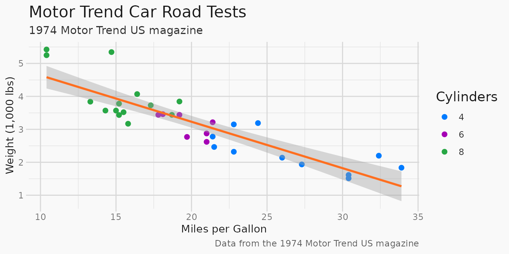
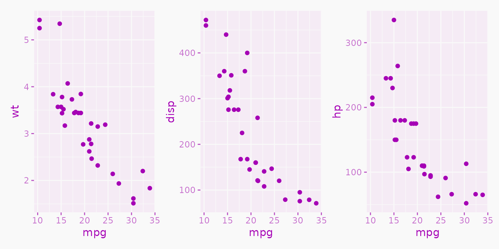

# Branded Themes

``` r

library(brand.yml)
```

## Overview

The **brand.yml** package includes helper functions for theming plotting
and table packages using your brand colors.

The `theme_brand_*` functions can be used in two ways:

1.  **With a brand.yml file**: The functions automatically detect and
    use a `_brand.yml` file in your current project. You can also
    explicitly pass a path to a brand.yml file or a brand object.

2.  **With explicit colors**: You can directly provide colors to
    override the default brand colors, or use `brand = FALSE` to ignore
    any project `_brand.yml` files.

## Creating a brand

This vignette demonstrates using the `theme_brand_*` functions with a
simple brand object created with
[`as_brand_yml()`](https://posit-dev.github.io/brand-yml/pkg/r/dev/reference/as_brand_yml.md),
but you can imagine this YAML being stored in a `_brand.yml` file in
your project directory.

First, we’ll create a brand object using a subset of the colors from the
brand.yml project’s own `_brand.yml` file:

``` r

brand <- as_brand_yml(
  '
color:
  palette:
    black: "#1A1A1A"
    white: "#F9F9F9"
    orange: "#FF6F20"
    purple: "#A500B5"
    pink: "#FF3D7F"
    blue: "#007BFF"
    green: "#28A745"
  foreground: black
  background: white
  primary: orange
  danger: pink
'
)
```

If you have a `_brand.yml` file in your project directory, you can read
it in with
[`read_brand_yml()`](https://posit-dev.github.io/brand-yml/pkg/r/dev/reference/read_brand_yml.md),
or just let the `theme_brand_*` functions find it automatically.

## ggplot2

The
[`theme_brand_ggplot2()`](https://posit-dev.github.io/brand-yml/pkg/r/dev/reference/theme_brand_ggplot2.md)
function creates a ggplot2 theme using brand colors. You can also
override individual colors by passing them directly:

``` r

library(ggplot2)

ggplot(mtcars, aes(mpg, wt)) +
  geom_point(size = 2, aes(color = factor(cyl))) +
  geom_smooth(method = "lm", formula = y ~ x) +
  scale_colour_manual(
    values = c(
      brand_color_pluck(brand, "blue"),
      brand_color_pluck(brand, "purple"),
      brand_color_pluck(brand, "green")
    )
  ) +
  labs(
    title = "Motor Trend Car Road Tests",
    subtitle = "1974 Motor Trend US magazine",
    caption = "Data from the 1974 Motor Trend US magazine",
    x = "Miles per Gallon",
    y = "Weight (1,000 lbs)",
    colour = "Cylinders"
  ) +
  theme_brand_ggplot2(brand)
```



## thematic

The
[`theme_brand_thematic()`](https://posit-dev.github.io/brand-yml/pkg/r/dev/reference/theme_brand_thematic.md)
function sets global theming for base R graphics and ggplot2. Use
[`thematic_with_theme()`](https://rstudio.github.io/thematic/reference/thematic_with_theme.html)
to apply the theme temporarily:

``` r

library(ggplot2)
library(patchwork)
library(thematic)

# Use thematic_with_theme to apply the theme temporarily
thematic_with_theme(theme_brand_thematic(brand, foreground = "purple"), {
  # Generate three scatterplots
  plot1 <- ggplot(mtcars, aes(mpg, wt)) +
    geom_point()

  plot2 <- ggplot(mtcars, aes(mpg, disp)) +
    geom_point()

  plot3 <- ggplot(mtcars, aes(mpg, hp)) +
    geom_point()

  # Display all three scatterplots in same graphic
  plot1 + plot2 + plot3
})
```



## ggiraph

The
[`theme_brand_ggplot2()`](https://posit-dev.github.io/brand-yml/pkg/r/dev/reference/theme_brand_ggplot2.md)
function works with ggiraph interactive plots. We can override specific
colors while using the brand defaults:

``` r

library(ggplot2)
library(ggiraph)

cars <- ggplot(mtcars, aes(mpg, wt)) +
  geom_point_interactive(aes(
    colour = factor(cyl),
    tooltip = rownames(mtcars)
  )) +
  scale_colour_manual(
    values = c(
      brand_color_pluck(brand, "orange"),
      brand_color_pluck(brand, "purple"),
      brand_color_pluck(brand, "green")
    )
  ) +
  theme_brand_ggplot2(brand)

girafe(ggobj = cars)
```

## plotly

The
[`theme_brand_plotly()`](https://posit-dev.github.io/brand-yml/pkg/r/dev/reference/theme_brand_plotly.md)
function applies brand colors to plotly plots. The function also accepts
an `accent` parameter for highlighting colors:

``` r

library(plotly)
```

    ## 
    ## Attaching package: 'plotly'

    ## The following object is masked from 'package:ggplot2':
    ## 
    ##     last_plot

    ## The following object is masked from 'package:stats':
    ## 
    ##     filter

    ## The following object is masked from 'package:graphics':
    ## 
    ##     layout

``` r

p <- plot_ly(
  iris,
  x = ~Species,
  y = ~Sepal.Width,
  type = "violin",
  box = list(visible = TRUE),
  meanline = list(visible = TRUE),
  points = "all"
)

theme_brand_plotly(p, brand, accent = "pink")
```

## gt

The
[`theme_brand_gt()`](https://posit-dev.github.io/brand-yml/pkg/r/dev/reference/theme_brand_gt.md)
function applies brand colors to gt tables. Here we use the brand’s
palette colors directly by name:

``` r

library(gt)

islands_tbl <- dplyr::tibble(name = names(islands), size = islands)
islands_tbl <- dplyr::slice_max(islands_tbl, size, n = 10)

theme_brand_gt(
  gt(islands_tbl),
  brand,
  background = "green",
  foreground = "white"
)
```

| name          | size  |
|---------------|-------|
| Asia          | 16988 |
| Africa        | 11506 |
| North America | 9390  |
| South America | 6795  |
| Antarctica    | 5500  |
| Europe        | 3745  |
| Australia     | 2968  |
| Greenland     | 840   |
| New Guinea    | 306   |
| Borneo        | 280   |

## flextable

The
[`theme_brand_flextable()`](https://posit-dev.github.io/brand-yml/pkg/r/dev/reference/theme_brand_flextable.md)
function applies brand colors to a flextable table. It uses the
`foreground` and `background` colors from the brand. Here we’ll use the
default brand we created above:

``` r

library(flextable)
```

    ## 
    ## Attaching package: 'flextable'

    ## The following objects are masked from 'package:plotly':
    ## 
    ##     highlight, style

``` r

ft <- flextable(airquality[sample.int(10), ])
ft <- add_header_row(ft, colwidths = c(4, 2), values = c("Air quality", "Time"))
ft <- theme_vanilla(ft)
ft <- add_footer_lines(
  ft,
  "Daily air quality measurements in New York, May to September 1973."
)
ft <- set_caption(ft, caption = "New York Air Quality Measurements")

theme_brand_flextable(ft, brand)
```

| Air quality |  |  |  | Time |  |
|----|----|----|----|----|----|
| Ozone | Solar.R | Wind | Temp | Month | Day |
|  |  | 14.3 | 56 | 5 | 5 |
|  | 194 | 8.6 | 69 | 5 | 10 |
| 18 | 313 | 11.5 | 62 | 5 | 4 |
| 8 | 19 | 20.1 | 61 | 5 | 9 |
| 36 | 118 | 8.0 | 72 | 5 | 2 |
| 19 | 99 | 13.8 | 59 | 5 | 8 |
| 23 | 299 | 8.6 | 65 | 5 | 7 |
| 28 |  | 14.9 | 66 | 5 | 6 |
| 41 | 190 | 7.4 | 67 | 5 | 1 |
| 12 | 149 | 12.6 | 74 | 5 | 3 |
| Daily air quality measurements in New York, May to September 1973. |  |  |  |  |  |

New York Air Quality Measurements {.table .cl-d8bad469
quarto-disable-processing="true"}
